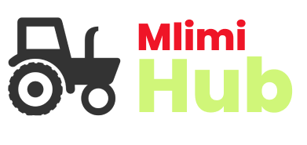

# Mlimi-Hub Project

## Overview

Mlimi-Hub is a revolutionary agricultural platform designed to empower farmers by fostering communication, facilitating resource-sharing, and providing valuable insights for optimized farming practices. This prototype, built with Vue.js for the frontend and Laravel for the backend, utilizes RESTful APIs to create a seamless and efficient user experience.

## Features

### 1. **Interactive Farmer Communication:**
   - Connect with fellow farmers, share experiences, and exchange valuable insights.
   - Real-time chat functionality to facilitate quick communication within the farming community.

### 2. **Input Marketplace:**
   - Discover and acquire farming inputs through a centralized marketplace.
   - Streamlined process for farmers to buy and sell agricultural products.

### 3. **Insights on Natural Disasters:**
   - Receive timely updates on potential natural disasters that may impact crop yield.
   - Access resources and guidelines to mitigate the effects of adverse weather conditions.

### 4. **Weather Integration:**
   - Integration with weather APIs to provide localized and accurate weather forecasts.
   - Empower farmers to make informed decisions based on upcoming weather patterns.

### 5. **User-Friendly Dashboard:**
   - Intuitive dashboard design for easy navigation and accessibility.
   - At-a-glance view of essential information such as weather updates, community discussions, and available farming inputs.

## Technologies Used

- **Frontend:** Vue.js
- **API:** RESTful

## Getting Started
1.navigate to the root of the application
2.run npm install
3. run npm start to start the application

## License

This project is licensed under the [MIT License]

Happy Coding!
